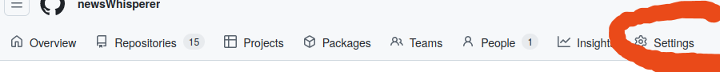
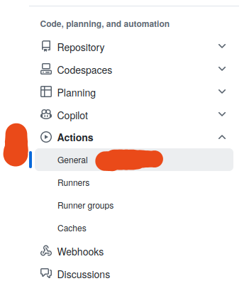
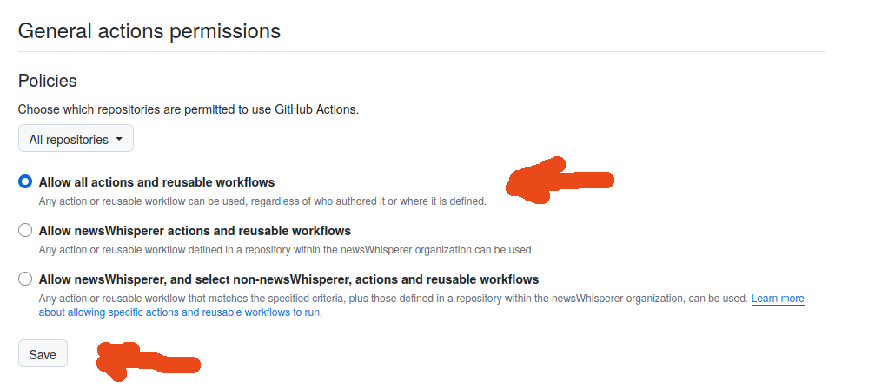
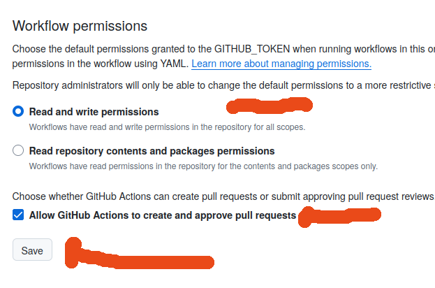
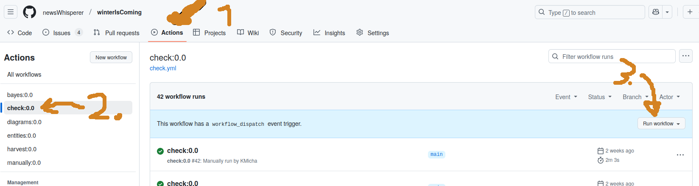
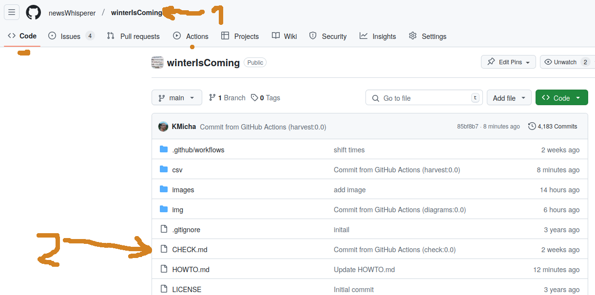
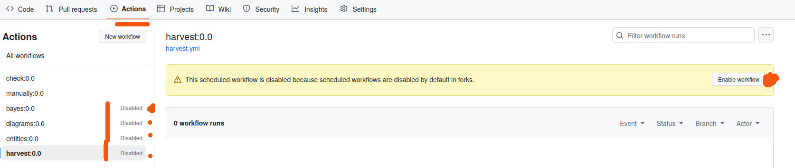

## How to setup your own harvester

The harvester works best with about 20 search-terms (called keyword here) organized below 4-6 topics.

---

### 1) Register at [github.com](https://github.com/signup)

* Some instructions can be found [here](https://docs.github.com/en/get-started/signing-up-for-github/signing-up-for-a-new-github-account)
* Register at  [github.com](https://github.com/signup) with email & password & username  (mine is kmicha)
* Make sure to register for a free version; well simply don"t enter credit card infos
* Maybe solve captcha
* Check eMail and enter verification code
* Sign in

---

### 2) Create an organisation at github.com

* Sign in and go to your organization page.

* Create a new organization with unique name - i.e. choose your username and append '-news', like 'kmicha-news'

 
* Choose free plan
* Enter same eMail as for account
* Choose 'My personal account'
* Verify Captcha
* No addons
* Accept Terms
* Add me (KMicha) to the organization
* Customize members permission from 'read' to 'admin'

---

### 3) Change settings of organisation for actions at github.com

* Go to settings

* Open below 'Code, Planning, and automation' the 'Action' section and press 'General' - press SAVE

* pressed *SAVE* ?

* Choose 'Allow all actions and reusable workflows' at the very top - press SAVE

* pressed *SAVE* ?

* Choose below 'Workflow permissions' (at the very bottom) the 'Read and write permissions' - press SAVE

* pressed *SAVE* ?

--- 

### 4) Fork the [newsWhisperer/winterIsComing](https://github.com/newsWhisperer/winterIsComing) repository to your new organization

* Goto [newsWhisperer/winterIsComing](https://github.com/newsWhisperer/winterIsComing), select 'fork' and 'Create a new fork'

* Choose your new organisation (with ending '-news') as owner (NOT THE USER NAME!)

* Press the green button

---

### 5) Add me to repository team with admin access

* Goto the settings page and select the 'Collaborators and Teams'
 
 

* Add me (KMicha) with admin access

---
 
### 6) Adapt the keywords and topics

The harvester works best with about 20 search-terms (called keyword here) organized below 4-6 topics.

* Goto  to your code page and select the keywords.csv file

-* Edit the keywords file
  * Make sure to keep the first (header-)line unchanged
  * keyword: Your searchterm with single quotes. Can combine severall words, like 'this that'. Keywords should be unique.
  * language: Choose your language (must be supported by newsapi). i.e. de or en
  * topic: Severall keywords are combined into a common topic. No quotes. No spaces.
  * topicColor: The hexcode of the topic. Same topics, same color codes!
  * keywordColors: Ech keyword can have a seperate color hexcode. Might be similiar to it"s realted topic color.
  * limitPages: Will be dynamically adapted. Set to 1 initially
  * ratioNew: will also be adapted. 1 is also fine.

Colorpickers can be googled. Or use one of these: [redketchup](https://redketchup.io/color-picker), [w3schools](https://www.w3schools.com/colors/colors_picker.asp)
  

  
Attention: You can adapt the keywords later, but for now you should not remove any, once you've started harvesting!

 * Submit the changed file. Description can be empty. Commit directly to main branch. Press the green button. 

---

### 7) Remove existing news_21yy_mm.csv files

Inside your repository, goto code, then inside csv folder, select news_2022_mm.csv file (one after the other) and delete it.
After each deletion,a commit must be done. 

---

### 8) Run Action : check:0.0

* Go to the Action tab 

* Select the check:0.0 workflow on the left panel
* Run workflow on the right side
* Wait for about 2-3 minutes for completion

---

### 9) Check CHECK.md

* Go to the Code tab

* Click on the CHECK.md file
* Follow the instructions for red errors
* Repeat step 8) & 9) until all fields are green

---

### 10) Enable other actions

* Goto action tab

* Enable all actions: bayes/diagrams/entities/harvest

